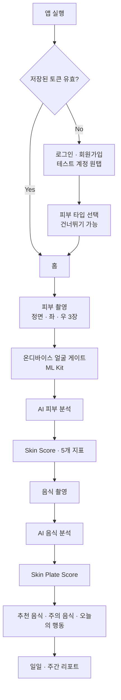
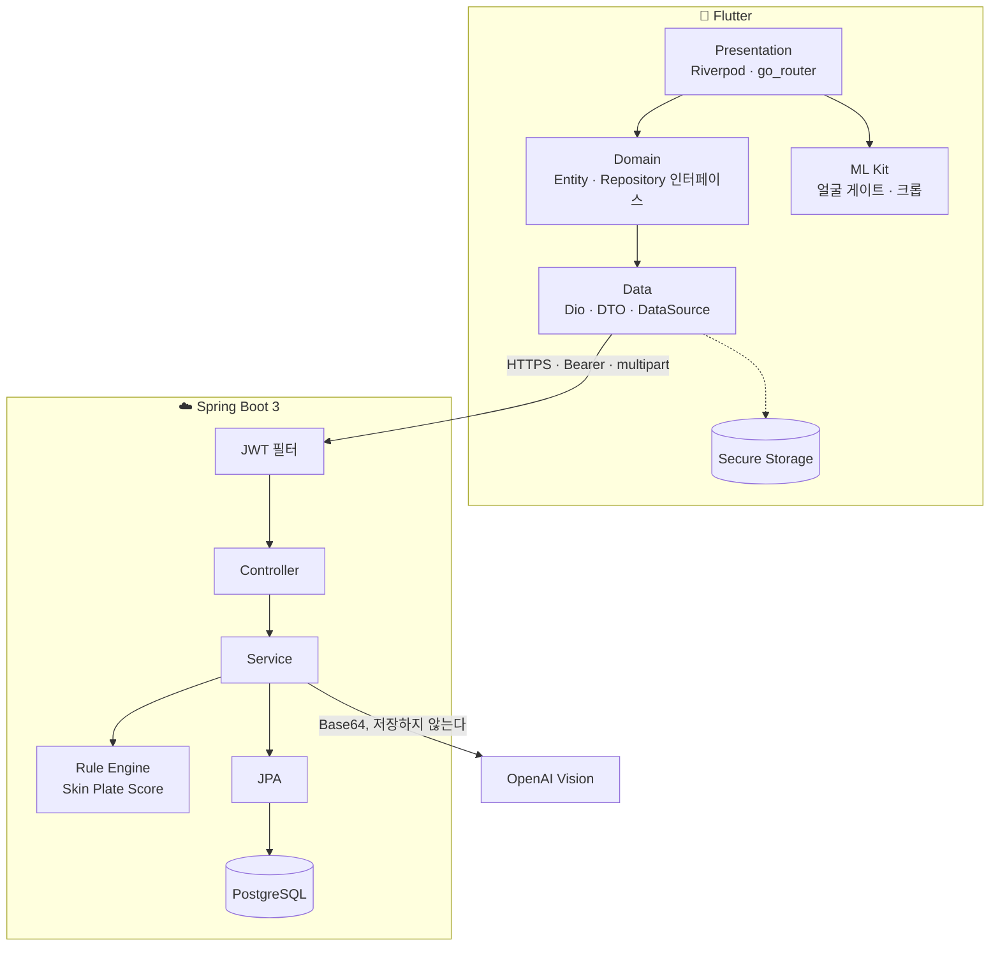

# Skin Plate (스킨픽)

> **오늘의 피부를 위한 오늘의 한 끼**
> 사진 한 장으로 내 피부에 맞는 음식을 확인한다.

AI 피부 분석을 **기준값**으로 삼아, 지금 먹으려는 음식이 오늘의 피부에 맞는지 점수와 한 문장으로 알려주는 모바일 앱. 해커톤 MVP (2026-08-08 ~ 08-21).

이 저장소는 **Flutter 앱**이다. 서버는 [`Skinpick-backend`](../Skinpick-backend) (Spring Boot 3 · PostgreSQL · OpenAI Vision).

---

## 무엇을 푸는가

피부 고민이 생기면 대부분 화장품을 먼저 바꾼다. 하지만 피부는 식습관의 영향을 크게 받고, 기존 피부 분석 서비스는 **"당신의 피부는 이렇습니다"에서 끝난다.**

Skin Plate 는 한 칸 더 간다.

```
피부 분석  →  음식 분석  →  오늘의 행동
```

| | 기존 피부 분석 | Skin Plate |
|---|---|---|
| 분석 대상 | 피부만 | 피부 + 음식 |
| 결과 | 수치와 진단 | 수치 + **눈앞의 식사를 바꾸는 한 문장** |
| 개인화 기준 | 자가 신고 피부 타입 (고정) | **오늘의 피부 상태 (가변)** |
| 재방문 | 월 1회 | 끼니마다 |

성공 기준은 하나다 — **사용자가 앱을 닫은 뒤 눈앞의 식사에서 실제로 뭔가를 바꾸는가.**
"국물을 절반만 남기세요" 같은 즉시 실행 가능한 한 문장이 이 제품의 최소 단위다.

---

## 사용자 흐름



**처음부터 끝까지 3분 이내**로 완주 가능해야 한다. 심사 시연이 곧 이 플로우다.

---

## 화면

| ID | 화면 | 핵심 |
|---|---|---|
| S00 | 스플래시 | 저장된 토큰 검사 → 로그인 생략 |
| S01 · S01b | 로그인 · 회원가입 | 테스트 계정 원탭 진입 |
| S01c | 피부 타입 선택 | 칩 한 번, 건너뛰기 가능 |
| S02 | 홈 | 오늘의 Skin Score, 오늘의 기록, 촬영 CTA |
| S03 | 피부 촬영 | 실시간 프리뷰 + 얼굴 가이드, 정면/좌/우 3단계 |
| S04 | 분석 로딩 | 단계 텍스트로 5~8초의 체감 대기를 줄인다 |
| S05 | 피부 결과 | Skin Score 게이지, 지표 바, 하이라이트 |
| S06 | 음식 촬영 | 온디바이스 라벨링으로 "음식으로 보이는가"만 확인 |
| S07 | Plate 결과 | Plate Score, 좋은 점 / 주의 / **AI 맞춤 TIP** |
| S08 | AI 추천 | 추천 음식 · 주의 음식 + 이유 |
| S09 | 기록 | 날짜별 Plate 기록 |
| S10 | 피부 인사이트 | 생활습관을 반영한 해석 |
| S11 | 리포트 | 일일 · 주간 탭 |
| S12 | 피부 프로필 | 타입 · 고민 · 생활습관 |

---

## 기술 스택

| 영역 | 선택 | 이유 |
|---|---|---|
| 프레임워크 | **Flutter 3.24+** / Dart 3.5+ | 한 코드베이스로 Android · iOS |
| 상태관리 | **Riverpod 2.x** (+ riverpod_generator) | 보일러플레이트가 적고 테스트에서 주입이 쉽다 |
| 라우팅 | **go_router 14.x** | 선언적 라우팅 + **인증 가드를 redirect 한 곳에** |
| 네트워크 | **Dio 5.x** | 인터셉터(JWT 첨부 · 401 처리), multipart |
| 모델 | **freezed + json_serializable** | 불변 DTO, 생성물은 커밋해 팀원이 build_runner 없이 받는다 |
| 토큰 저장 | **flutter_secure_storage** | Keychain / Keystore |
| 얼굴 감지 | **google_mlkit_face_detection** | 온디바이스 게이트 + 크롭 (판정에는 쓰지 않는다) |
| 음식 감지 | **google_mlkit_image_labeling** | "음식으로 보이는가"만. 종류·영양은 서버 몫 |
| 이미지 | camera · image_picker · flutter_image_compress · image | 촬영 → 크롭 → 1024px 리사이즈 → JPEG q80 |
| 아이콘 · 폰트 | flutter_svg · Pretendard (SIL OFL) | 시안 그대로. 웨이트 4종만 넣어 APK 를 지킨다 |
| 테스트 | flutter_test | **449개 통과** (44개 파일) |

서버는 Spring Boot 3.3 / Java 21 / Spring Security + JWT / Spring Data JPA / PostgreSQL / OpenAI Vision.

---

## 아키텍처



**책임 분리** — AI 는 *인식*만 한다. 점수와 문장은 서버가 소유하고, 앱은 촬영·상태·시각화를 맡는다.

> 점수 계산을 LLM 에 맡기면 같은 사진에 다른 점수가 나와 **시연 중 재현이 불가능**해진다.
> 규칙 기반이라 심사위원이 같은 사진을 두 번 찍어도 같은 점수가 나온다.

### 앱이 지키는 세 가지 원칙

1. **판정 규칙을 앱에 만들지 않는다.** 높음/낮음은 서버 `highlights`, 과다/부족은 서버 `feedbacks`, 등급은 `grade` · `level` · `status` 가 이미 정해서 온다. 앱에 임계값을 두면 같은 68점이 홈에서 "보통", 리포트에서 "좋음"으로 뜬다 — 실제로 겪었다.
2. **ML Kit 은 게이트와 크롭 전용이다.** 얼굴 확률값으로 피부를 판정하지 않는다. 얼굴만 크롭해 올리면 같은 업로드 용량으로 얼굴의 실효 해상도가 3배 이상 오른다.
3. **결과 화면은 방금 찍은 로컬 파일을 쓴다.** 서버는 이미지를 Base64 로 OpenAI 에 보내고 버린다 — 이미지 저장소가 없는 게 맞다.

---

## 프로젝트 구조

```
lib/
├── app/          # 앱 셸 — 라우터, 테마, 피처 플래그
├── core/         # 횡단 관심사
│   ├── network/  #   Dio 클라이언트 · JWT 인터셉터 · 401 처리 · 응답 봉투
│   ├── mlkit/    #   카메라 프레임 → InputImage
│   ├── camera/   #   프리뷰 비율 · 카메라 오류 문구
│   └── storage/ · error/ · result/ · di/ · utils/ · widgets/
├── features/     # 기능별 data / domain / presentation 3계층
│   ├── auth/            # 로그인 · 회원가입 · 피부 프로필
│   ├── home/            # 홈
│   ├── skin_analysis/   # 피부 촬영 · 분석 · 결과 · 인사이트
│   ├── skin_plate/      # 음식 촬영 · Plate 결과 · 기록
│   ├── recommendation/  # 추천 · 주의 음식
│   └── report/          # 일일 · 주간 리포트
└── shared/       # 공용 enum · 위젯
```

연동 API: `/auth/*` · `/skin/analyses` · `/plates/analyze` · `/plates/records` · `/recommendations` · `/reports/daily|weekly` · `/skin-insights`

---

## 실행

```bash
flutter pub get

# 로컬 서버 (Android 에뮬레이터는 10.0.2.2, iOS 시뮬레이터는 localhost)
flutter run --dart-define=API_BASE_URL=http://10.0.2.2:8080/api/v1

# 배포 서버는 릴리스 빌드의 기본값이라 define 없이도 붙는다
flutter build apk --release
```

테스트 계정 `test@skinplate.app` / `test1234!` — 로그인 화면의 **"테스트 계정으로 시작하기"** 원탭.

```bash
dart run build_runner build --delete-conflicting-outputs   # *_dtos.dart 를 고쳤으면 필수
flutter analyze && flutter test                            # 커밋 전 둘 다 통과
```

시크릿·키는 하드코딩하지 않는다. 전부 `--dart-define` 으로만 주입한다.

---

## 팀 규칙

- 브랜치 `{type}/{설명}`, 커밋 `{type}({scope}): 작업 내용` (Conventional Commits + 한국어)
- 1개 단위 = 1 브랜치 = 1 PR. 화면 단위로 자른다. 전부 `develop` 으로
- `pubspec.yaml` · iOS `Podfile` · Android 설정은 **한 사람이 전담한다**

자세한 규약은 [`CLAUDE.md`](CLAUDE.md), 디자인 시스템은 [`DESIGN.md`](DESIGN.md).
